OmiPlay 遊戲影音傳輸器 | 在筆電上爽玩遊戲主機
===

OmiPlay AI 即時影音升頻技術實測！延遲僅 0.06 秒，給你更流暢的畫面體驗\
2021/04/17 10:43 

各位 OmiPlay 支持者大家好

先前我們跟大家提到將在 OmiPlay 中導入「AI即時影像升頻」技術，將遊戲畫面由 30 FPS 升頻到更流暢的 60 FPS，目前已經有階段性的成果囉！根據我們的測試，畫面延遲最快只要 0.06 秒，在升頻享受流暢畫面的同時，盡可能地減少對您在遊戲時的影響！

## AI 即時影音升頻技術實測#

我們將升頻結果錄影和大家報告，以下這支測試影片中我們用 Frame by Frame (影格逐格播放) 的方式進行實測。左側 30 fps 的畫面因為影格數較少，每一個影格的移動較大，畫面抖動的感覺比較明顯；而右側經過升頻處理的 60 fps 畫面則每一個影格都有變化，畫面跳動更小，視覺上畫面更加流暢。

- [OmiPlay AI 即時影像升頻技術實測 (第一版)](https://www.youtube.com/watch?v=s_tmoQYZ1k4)

## 堅持研發獨家功能，OmiPlay 使用者獨家享受！#

OmiPlay 承諾給玩家更好的遊戲體驗，除了影像升頻外，在專屬軟體 OmiCast 中我們也針對影像畫質、音質上做了相當多的最佳化，您再也不用擔心影音不同步、聲音抖動甚至是爆音…等問題 (使用其他設備或公版播放器常見)，真正實現即插即享受的樂趣。

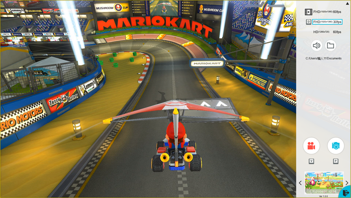\
▲ OmiCast 實際使用畫面，錄影、檔案管理、性能模式切換輕鬆明瞭

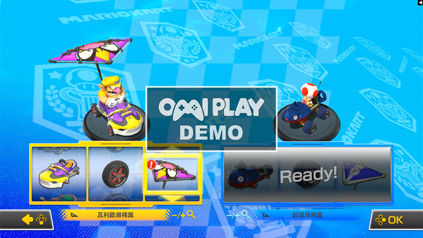\
▲ OmiCast 這些好用的功能都屬於 OmiPlay 玩家專屬！

大家好！我們是視旅科技，我們發現許多人對於用筆電玩遊戲主機有高度需求，因此我們打造了【OmiPlay 遊戲影音傳輸器】，讓您可以擺脫電視的限制，用比電就能開心玩！

✅ 高畫質流暢感 | 支援4K輸入、1080p/60fps 高品質輸出
✅ 即時影音升頻 | 獨家AI即時升頻60 FPS，畫面流暢低延遲
✅ 雙系統都支援 | 支援 Windows/MacOS 雙系統
✅ 相容各式主機 | 完整支援 PS、Switch、XBOX 系統
✅ 獨家專屬軟體 | 專屬為玩家開發，多種功能強化遊戲體驗
✅ 實況最強後盾 | 相容OBS等實況軟體，實況主直播更方便
✅ MIT 台灣研發 | 台灣團隊研發，資安免煩惱

我們的團隊在已經累積了10餘年影音硬體研發經驗。這次我們堅持簡單至上，複雜的設定全都交給我們處理，只要 **3 個步驟、5 秒鐘**就可以一圓「隨處都是電動間」的夢想！超簡單！

① 插入 OmiPlay\
② 把 USB 線插入筆電\
③ 在電腦暢玩遊戲主機！

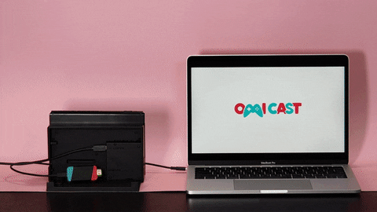

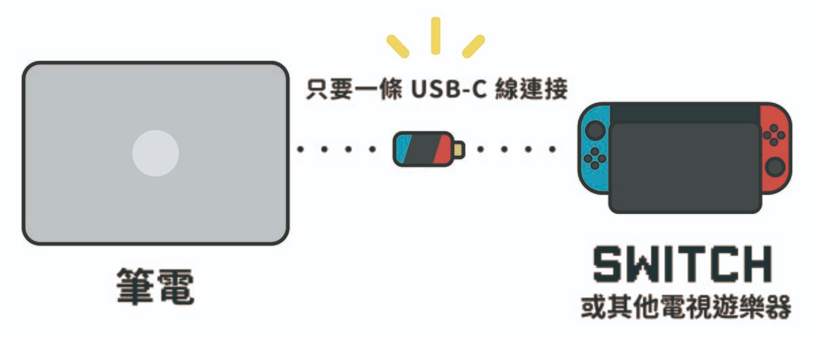

精心打造的 OmiPlay 外型設計兼具散熱性能和遊戲風格，可以直接插在 Switch 及各種主機上使用 (尺寸持續瘦身中)，輕盈便攜簡單好用，讓玩家單純地享受遊戲樂趣。

.gif)

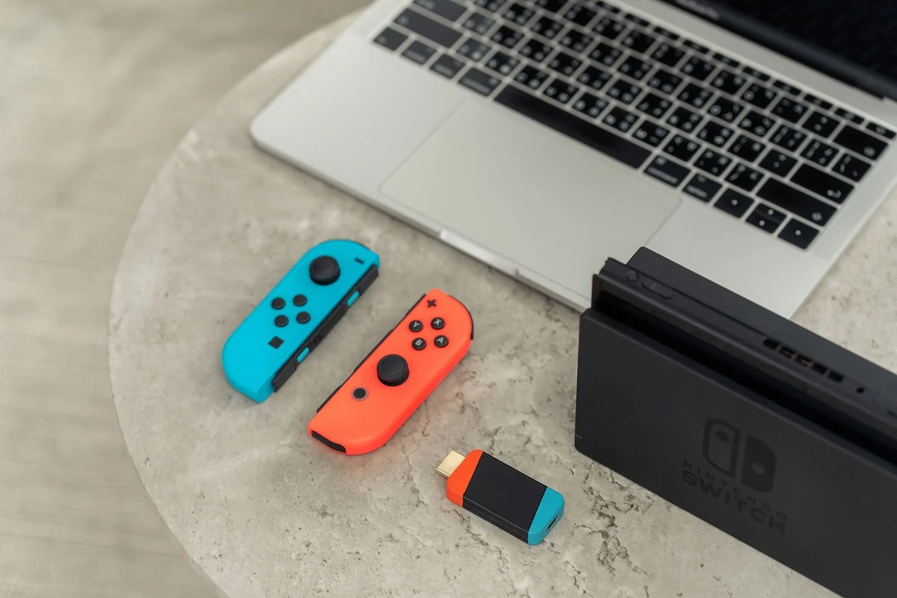

同樣身為玩家的我們完全理解「低延遲」對遊戲體驗的重要性，因此我們進行了大量的測試及優化，將延遲降低到**極致的 0.02 秒 (720p) 及 0.04 秒 (1080p)**，同時也提供了最高 1920×1080 @ 60fps 的流暢畫面品質。

根據實際進行測試，在筆電上遊玩時幾乎無延遲，即便是對時間點相當敏感的賽車遊戲，操作手感也幾乎沒有差異！

.gif)\
* 720P時遊戲延遲 0.02 秒，1080P時遊戲延遲 0.04 秒。

支援 Switch 擴充底座、PS、Xbox、單眼相機，甚至是有線電視機上盒，**只要使用 HDMI 輸出都可以透過 OmiPlay 將畫面顯示在電腦螢幕，也可以搭配錄影，應用更多元**。只需要一條 USB-C 傳輸線就能完成！

## Windows / MacOS / Android 多平台支援

強力的研發團隊是我們給玩家的強力援助，OmiPlay 支援 Windows/MacOS 雙作業系統，我們也將持續開發 Android 等更多平台版本，讓您搭配不同的設備使用！

為了讓玩家更方便使用，我們開發了 OmiCast 軟體，提供優於 OBS 的影音傳輸性能，還有許多專為玩家打造的貼心功能，例如：(1)無限制的錄製遊戲內容、(2)即時麥克風混錄音，讓你錄製的遊戲內容生動有趣。 

我們也將持續打造各種新功能，也歡迎您隨時向我們「許願」，當然，這些功能只會獻給 OmiPlay 使用者。

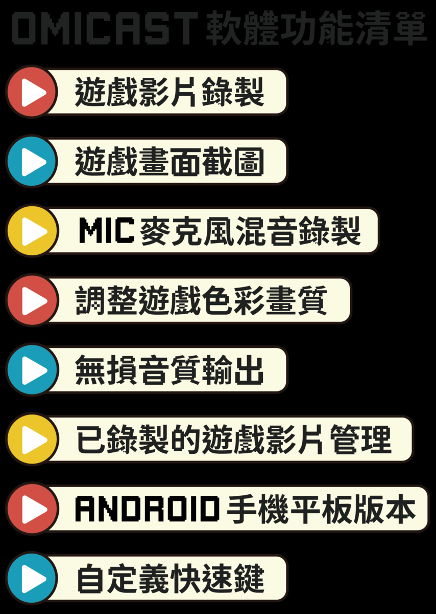

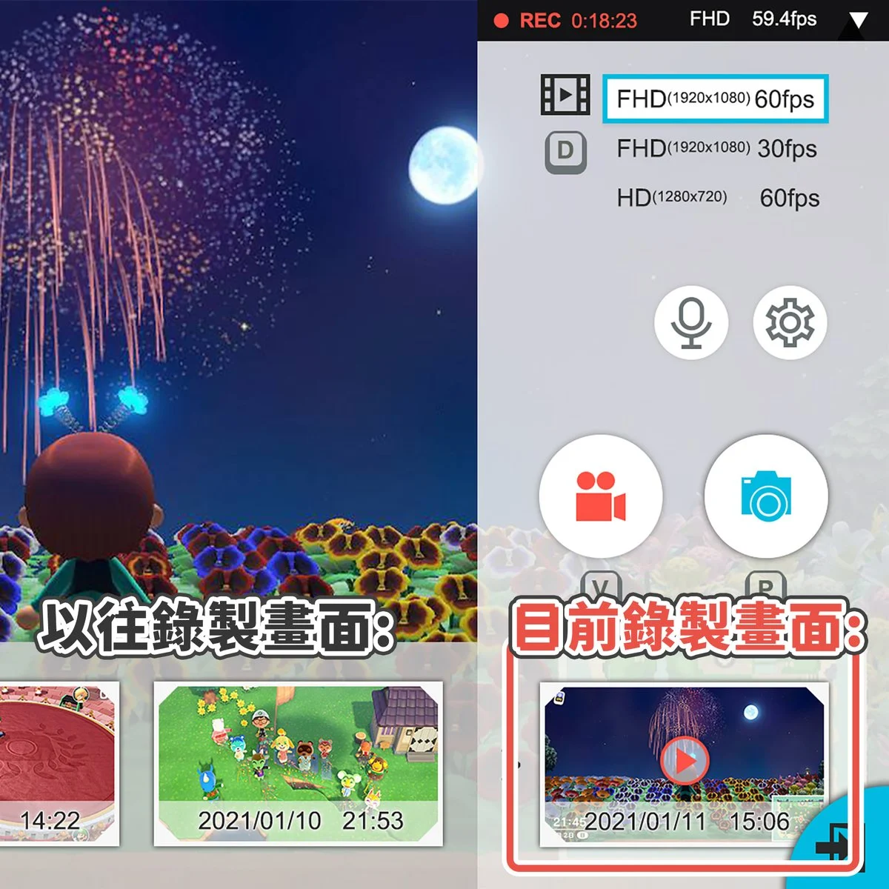\
▲ OmiCast 實際畫面 (開發中，未來可能會有變動)

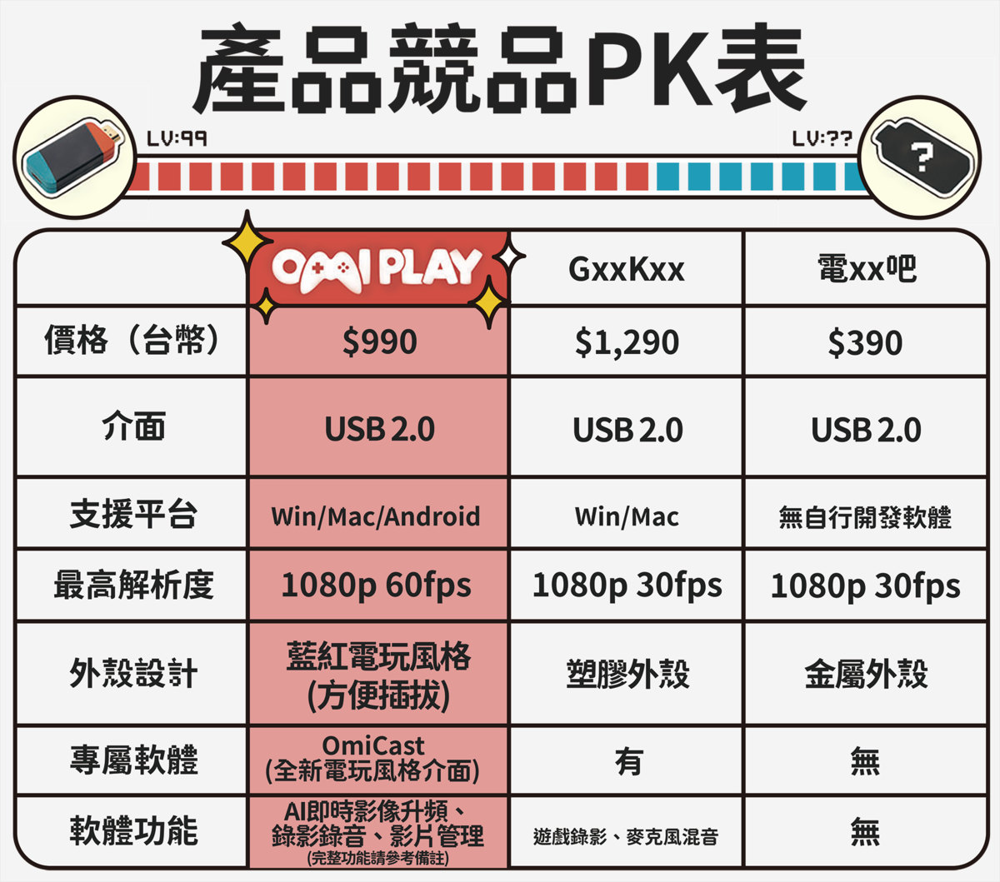

以上三個版本請由官網連結下載\
https://omiplay.fun/

註：專屬軟體 OmiCast 提供：30 to 60fps AI即時影像升頻、影片錄製、截圖、麥克風混音、畫面色彩調整、無損音質輸出、影像畫質調整…等多項獨家功能，且須搭配 OmiPlay 才可使用。

OmiPlay 支援各種直播平台，如 YouTube、Facebook、Twitch…等，您可以搭配 OBS、Xsplit 等串流軟體，和全世界的粉絲網友分享你的遊戲實況！

除了遊戲以外，OmiPlay 還可搭配各種不同的視訊裝置，組合出各種超實用的使用情境，例如：

單眼相機 + (OmiPlay) + 旗艦手機 = 高色準監看螢幕
(立刻省下 $23,000 元!!)

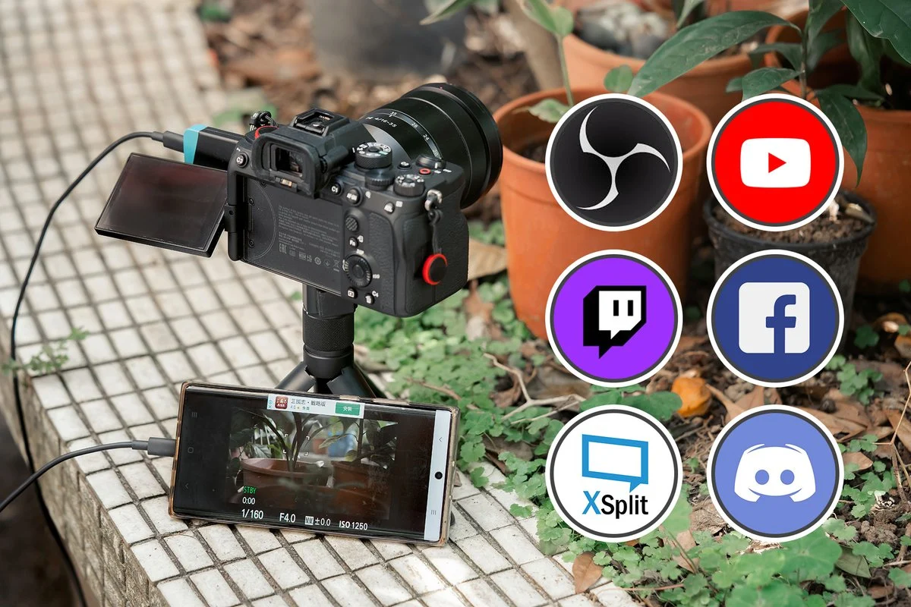

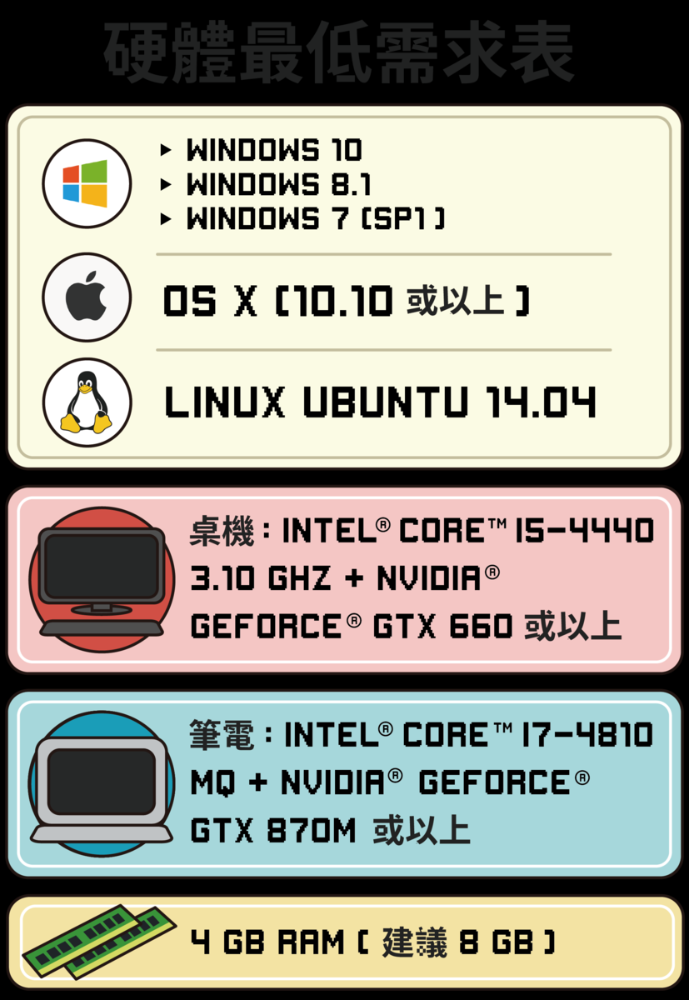

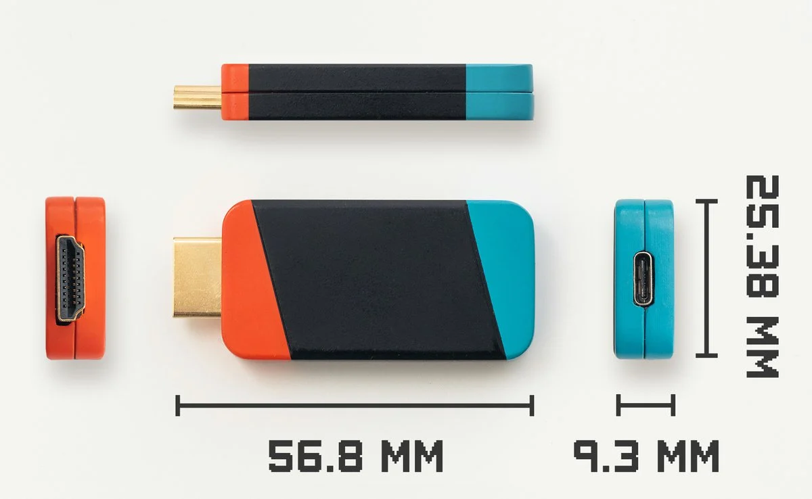

※ 尺寸為目前開發進度，團隊正在持續縮小體積，以打造最小最有設計感的產品為目標！

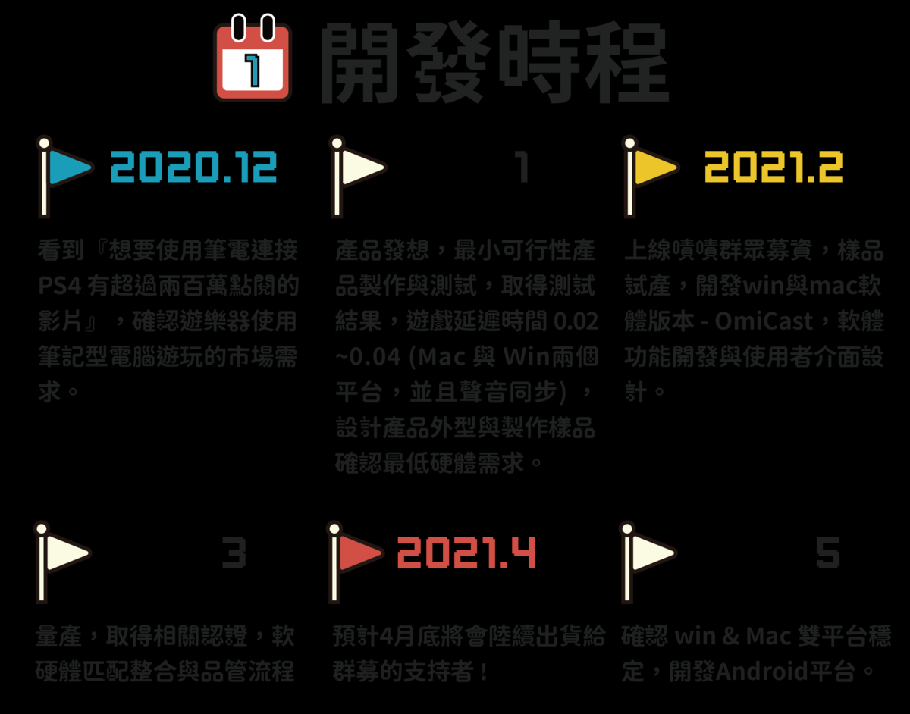

###### 相關文章

- [嘖嘖 | OmiPlay 遊戲影音傳輸器 | 在筆電上爽玩遊戲主機 | 現在買再省$700元](https://www.zeczec.com/projects/omiplay-switch-ps5)
- [OmiPlay 奧米丸 - 用你的電腦螢幕爽玩 Switch / PS5 FB](https://www.facebook.com/omiplay.tw)
- [OmiPlay 官網](https://omiplay.fun/)

